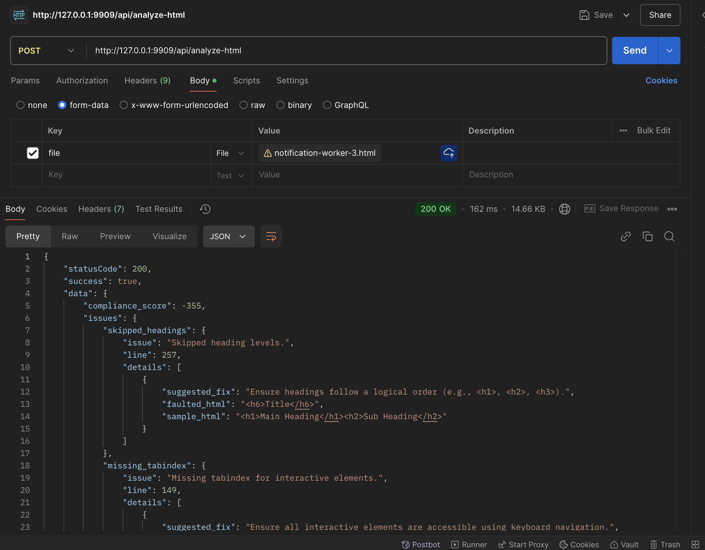

<!-- ## About this repository

WCAG stands for Web Content Accessibility Guidelines. In simple terms, it's a set of rules that help make websites easier to use for people with disabilities, like those who are blind, deaf, or have difficulty using a mouse. These guidelines ensure that websites are accessible to everyone, no matter their abilities.

This API application features the following:

- Accept an HTML file upload.
- Analyze accessibility issues (e.g., `missing alt attributes`, `skipped heading levels`) using a rule-based algorithm.
- Return a JSON response with a compliance score and suggested fixes. -->

# Accessibility Compliance Analysis System

## Overview

This system is designed to analyze the accessibility compliance of uploaded HTML files against key WCAG 2.1 guidelines. The primary function of the service is to scan HTML content and identify potential issues related to accessibility. It provides a compliance score and a list of accessibility issues, along with suggested fixes for each detected issue.

---

## Components

1. **HTMLFileUploadRequest** (Request Class)
2. **AccessibilityController** (Controller Class)
3. **AccessibilityService** (Service Class)

---

## Architecture Overview

The system operates with three core components:

1. **Frontend (User Interface)**  
   Allows users to upload HTML files.
   
2. **Backend**  
   Contains the **AccessibilityController** and **AccessibilityService**. The controller is responsible for accepting the uploaded file, validating it, and passing the content to the service for analysis.
   
3. **Service Layer**  
   The **AccessibilityService** processes the HTML content, performs WCAG checks, and returns a compliance score along with a list of issues.

---

## Flow of the Application

### 1. HTML File Upload
- The user uploads an HTML file via the [frontend](https://wcag-test-frontend.vercel.app/).
- The request is handled by **HTMLFileUploadRequest**, which validates the file (checking if it's an HTML file and does not exceed the file size limit).

### 2. File Processing
- If validation passes, the file is passed to the **AccessibilityController** where the content is extracted.
- The controller sends the content to the **AccessibilityService** for analysis.

### 3. Accessibility Analysis
- The **AccessibilityService** analyzes the HTML file for common accessibility issues (e.g., missing alt attributes, skipped heading levels, color contrast, etc.).

### 4. Response
- The service returns a compliance score (out of 100) and a list of issues with suggested fixes.
- The controller then returns the results in a JSON response to the frontend.

---

## Request Validation - HTMLFileUploadRequest

The **HTMLFileUploadRequest** class is responsible for validating the incoming request before any processing begins. It ensures that the uploaded file is an HTML file and does not exceed the size limit.

### Key Features:
- **file**: The uploaded file must be an HTML file with a MIME type of `html` and a maximum size of **256 KB**.
- **stopOnFirstFailure**: Validation stops as soon as the first error is encountered, providing quicker feedback.

---

## Controller - AccessibilityController

The **AccessibilityController** receives the validated request, extracts the HTML file content, and passes it to the **AccessibilityService** for analysis. If the HTML file is empty, it returns an error.

### Key Features:
- **HTML file extraction**: Extracts the raw content of the uploaded HTML file using `file_get_contents`.
- **Empty file check**: If the file is empty, a `400 Bad Request` response is returned.
- **Calling the Service**: Passes the HTML content to **AccessibilityService** for detailed analysis.

---

## Service Layer - AccessibilityService

The **AccessibilityService** is the heart of the analysis process. It scans the HTML content for specific accessibility issues based on WCAG 2.1 guidelines. Each issue detected is accompanied by a suggested fix, and the compliance score is adjusted based on the severity of the issues.

### Scoring Logic:
1. **Initial Score**: The score starts at **100** and is deducted based on the severity of issues found in the HTML content.
2. **Issue Severity**: Each identified issue has a predefined score deduction:
   - **5 points** for minor issues (e.g., missing alt attributes, low color contrast, missing labels).
   - **10 points** for more severe issues (e.g., skipped heading levels, missing form labels with for attributes).
3. **List of Issues**: The service returns a list of detected accessibility issues. Each issue contains:
   - The issue description.
   - The suggested fix to resolve the issue.

### Example Issues:
- Missing alt attribute for images.
- Skipped heading levels.
- Broken links.

---

## Compliance Scoring

The service calculates a compliance score by:

1. Starting at **100 points**.
2. Deducting points for each issue detected:
   - **5 points** for minor issues.
   - **10 points** for major issues.
3. The final compliance score is returned as part of the response.

### Example of Scoring:
- **Missing alt attributes**: Deduct 5 points.
- **Skipped heading levels**: Deduct 10 points.
- **Low color contrast**: Deduct 5 points.

The final score could be **80/100** if **20 points** were deducted from the original score.

---

## Conclusion

This design outlines a robust system for analyzing accessibility issues in HTML files based on WCAG 2.1 guidelines. By incorporating various accessibility checks such as image alt text, heading structure, color contrast, and form labels, the service can provide developers and content creators with valuable insights into the accessibility of their websites. With this system in place, users can easily understand and address potential accessibility issues, improving the overall user experience for everyone.

## Environment Setup (local)

1. CD into the application root directory with your command prompt/terminal/git bash.
2. Run `cp .env.example .env` command to create a local environment configuration file.
3. Inside the `.env` file, setup database, mail and other configurations for `production` (optional for this project).
4. Run `composer install` to install the project dependencies in the `composer.json` file.
5. Run `php artisan key:generate` command to generates the application key.
6. Run `php artisan serve` or `php artisan serve --port=PORT_NUMBER` command to start a local development server.
7. Define additional routes in the `routes/api.php` file.
8. Run `composer dump-autoload` to generate new optimized autoload files (optional).

## Docker Setup

This guide will help you set up and run your Laravel project using Docker.

## Prerequisites

Before starting, ensure you have the following installed:
- [Docker](https://www.docker.com/products/docker-desktop/) (including Docker Compose)

## Build and Run Docker Containers

1. Clone your Laravel project (if you haven't already):
   ```bash
   git clone https://github.com/Xand3rxx/wcag-test-backend.git
   cd <your-project-directory>
   ```

2. Build and run the Docker containers with the following command:
    ```
    docker-compose up -d --build
    ```

    This command will:
    - Build the Docker images based on the Dockerfile for the Laravel application.
    - Start the application and the necessary services (e.g., PHP, MySQL) in the background.

## What Happens in the build.sh Script
When the container starts, the following steps are executed in the /docker/build.sh script:

1. **Install Laravel dependencies:** The `composer install` command installs all required PHP dependencies defined in `composer.json`.
2. **Set up environment:** Copies the `.env.development` file to `.env` and generates the Laravel application key.
3. **Clear application cache:** Optimizes and clears the Laravel cache.
4. **Set permissions:** Ensures the necessary directories (bootstrap and storage) have proper write permissions.
5. **Start PHP-FPM:** The `php-fpm -D` command starts PHP FastCGI Process Manager in the background.

## Accessing the Application

Once the containers are running, you can access your Laravel application by navigating to [http://localhost:9600](http://localhost:9600) in your web browser.

## Stopping and Removing Containers

To stop the running containers:
```
docker-compose down
```

To stop and remove containers, networks, and volumes (useful for resetting everything):
```
docker-compose down --volumes
```

## Troubleshooting

If you run into any issues, you can check the logs of the app container with:
```
docker-compose logs app
```

If you run docker and get the error

```
Error response from daemon: Mounts denied: 
The path <your-project-directory>/docker/www.conf.default is not shared from the host and is not known to Docker.
```

```
You can configure shared paths from Docker -> Preferences... -> Resources -> File Sharing.
```

## Running Tests
To run the test suite and ensure everything is working as expected, follow these steps:

1. Install PHPUnit (if you don't already have it): `composer require --dev phpunit/phpunit`
2. Run the tests: Run the following command to execute all the tests, including the `AccessibilityServiceTest`: `php artisan test` or `vendor/bin/phpunit`
3. Running a specific test: If you want to run the `AccessibilityServiceTest` specifically, you can use the following command: `vendor/bin/phpunit --filter AccessibilityServiceTest`
4. Check test results: After running the tests, PHPUnit will output the test results in the terminal. Look for the section where the tests for the `AccessibilityServiceTest` class are listed to ensure all tests pass.

## Project Test Results

```
   PASS  AccessibilityServiceTest
  ✓ it detects missing alt attribute                                                                                      0.01s  
  ✓ it detects skipped heading levels
  ✓ it detects missing tabindex for interactive elements
  ✓ it detects missing labels for form fields
  ✓ it detects missing skip navigation link
  ✓ it detects font size too small
  ✓ it detects broken links
  ✓ it detects missing input labels

  Tests:    8 passed (31 assertions)
  Duration: 0.07s
```

## Project Screenshot


